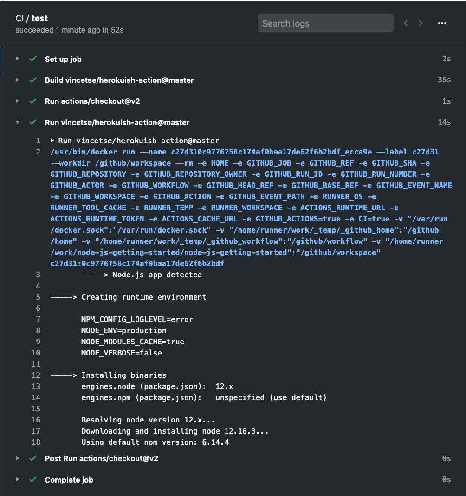

# Herokuish GitHub Action

A GitHub Action that builds an application like [Heroku](https://www.heroku.com/) would by using the [Herokuish](https://github.com/gliderlabs/herokuish) container to emulate the Heroku build process.

## Usage

Here is [an example GitHub Workflow](https://github.com/vincetse/node-js-getting-started/blob/master/.github/workflows/ci.yml) that uses the `master` branch of this action.

```
name: CI
on: [push, pull_request]
jobs:
  test:
    runs-on: ubuntu-latest
    steps:
    - uses: actions/checkout@v2
    - uses: vincetse/herokuish-action@master
```

## Sample Run

You can see [a sample run](https://github.com/vincetse/node-js-getting-started/runs/648336858?check_suite_focus=true) here.


